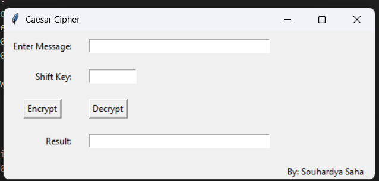

# 🎨 Caesar Cipher GUI 🛡️



## What Is This?
A charming Python desktop app built with **Tkinter**, bringing the classic **Caesar Cipher** to life! Shift your letters forward or backward with a bespoke key and watch your message transform in real time. 🕰️🔐

## 🚀 How It Works
1. **Enter Message** ✍️  
   Type or paste your plaintext (to encrypt) or ciphertext (to decrypt) into the top field.  
2. **Choose Shift Key** 🔢  
   Input an integer value indicating how many positions each letter should move.  
3. **Encrypt / Decrypt** 🔄  
   • **Encrypt** shifts letters *forwards* by your key.  
   • **Decrypt** shifts them *backwards*.  
4. **View Result** 👀  
   The output box will display your transformed text instantly. Invalid or empty inputs trigger a friendly error popup.

## 💻 Installation
```bash
git clone https://github.com/yourusername/caesar-cipher-gui.git
cd caesar-cipher-gui
pip install -r requirements.txt   # Tkinter is bundled with most Python installs
```

> Crafted with ❤️ , powered by Python & Tkinter!

